# SkyMap-X — Workflows (step by step)

Which keys and actions, in which order, get you to your goal. All keys are the defaults (rebindable under *Settings → Keybindings → SkyMap-X*, see [Keybinds](Keybinds)). Items are listed in [SkyMap-X → Items / Prefabs](SkyMap-X#items--prefabs).

> **Clicking on the tablet:** In **Big mode** (`Shift+E`) the mouse cursor is always on. In **Hand** and **Mini** mode turn it on with `Alt+Ctrl` first. Then left‑click buttons, lists, checkboxes and text fields.

## 0. Basics: switch on and pick a view

Every other workflow starts here.

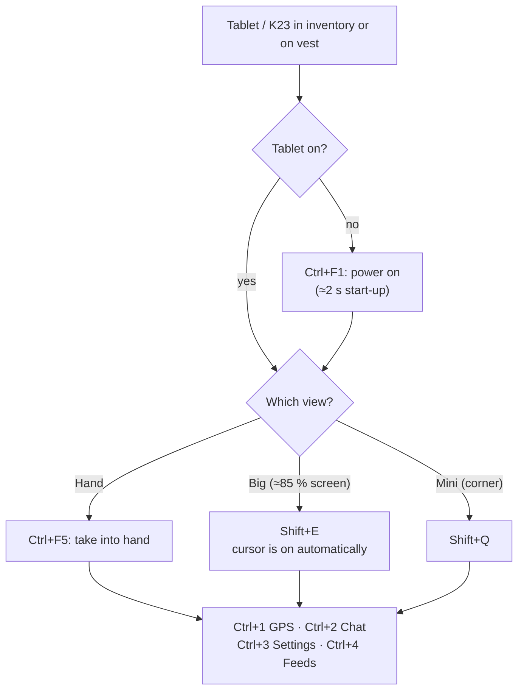

Tip: *Game Settings → SkyMap-X → Auto start / Auto mode* powers the tablet on at mission start and opens your default mode.

## 1. Set up channels (once)

Chat contacts, feeds and BFT markers only show devices whose **sending channels** match your **receiving channels**. Without matching channels the lists stay empty.

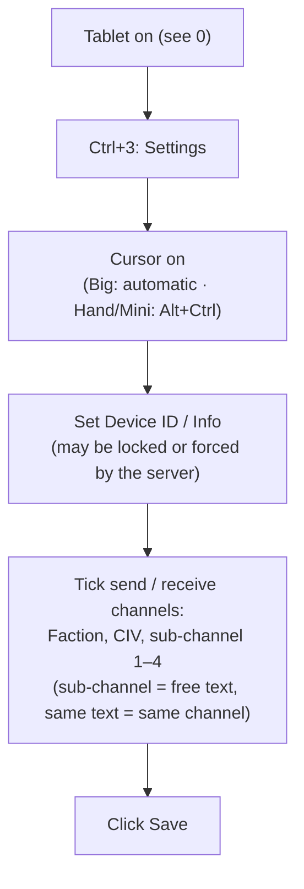

## 2. GPS map

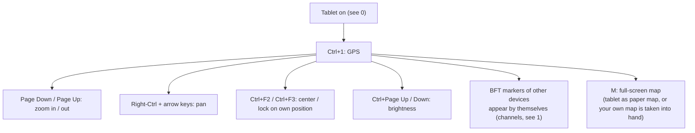

## 3. Write a chat message

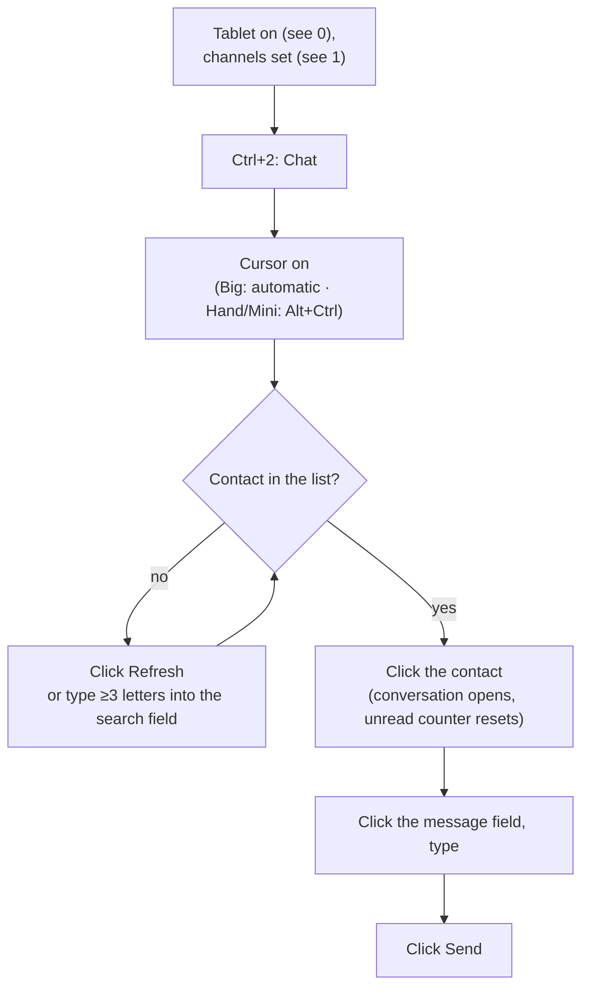

Unread messages are counted per contact in the list; opening the contact resets the counter.

## 4. Watch a helmet camera

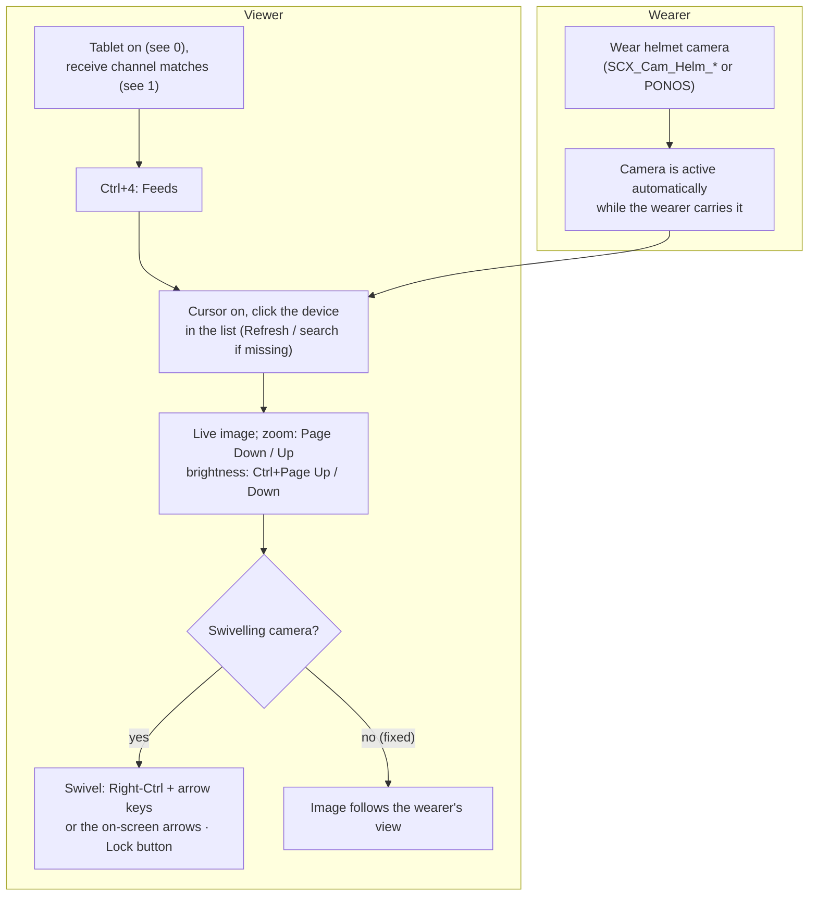

There are **fixed** and **swivelling** helmet cameras (set per item). A fixed one always shows where the wearer is looking; a swivelling one can also be turned from the tablet.

## 5. Use the ARC‑40 camera grenade

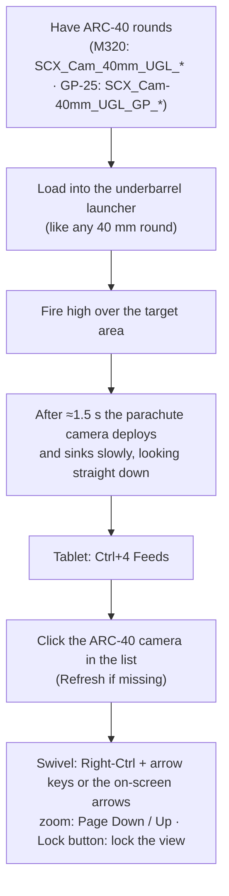

Everyone on a matching receive channel sees the ARC‑40 in their Feeds list — you can spot for the whole squad.

---

# SkyMap-X — Abläufe (Schritt für Schritt)

Welche Tasten und Aktionen in welcher Reihenfolge zum Ziel führen. Alle Tasten sind die Standardbelegung (änderbar unter *Einstellungen → Tastenbelegung → SkyMap-X*, siehe [Keybinds](Keybinds)). Die Items stehen unter [SkyMap-X → Items / Prefabs](SkyMap-X#items--prefabs-1).

> **Klicken am Tablet:** Im **Big-Modus** (`Shift+E`) ist der Mauszeiger immer an. Im **Hand**- und **Mini**-Modus zuerst mit `Alt+Strg` einschalten. Dann per Linksklick Buttons, Listen, Checkboxen und Textfelder bedienen.

## 0. Grundlage: Einschalten und Ansicht wählen

Jeder andere Ablauf beginnt hier.

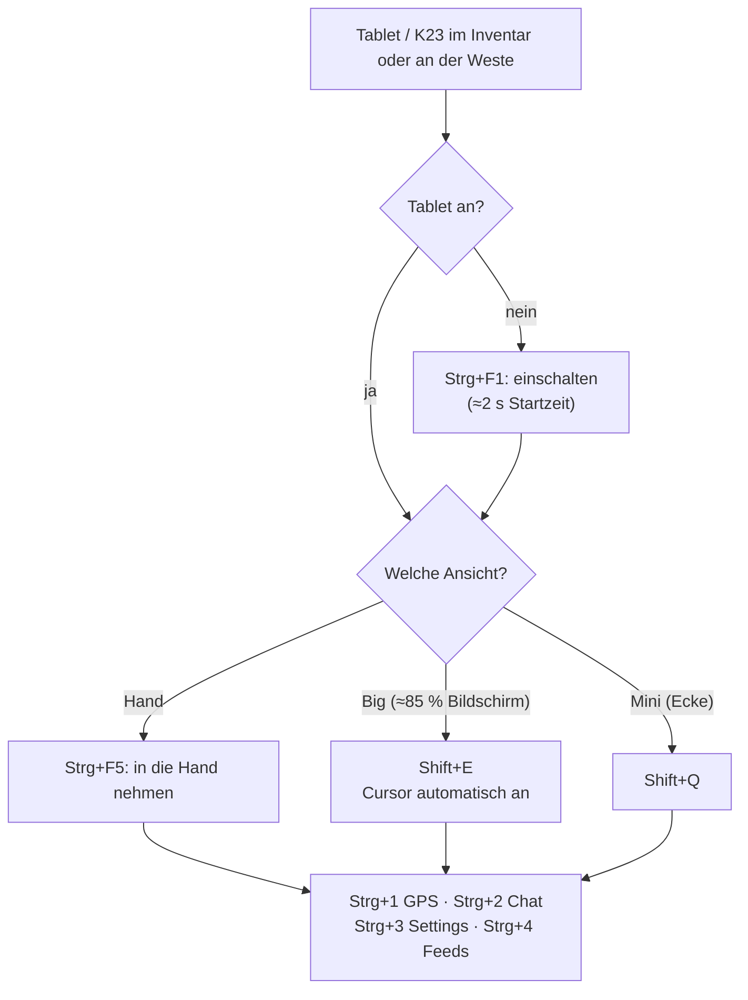

Tipp: *Spiel-Einstellungen → SkyMap-X → Auto-Start / Auto-Modus* schaltet das Tablet bei Missionsstart ein und öffnet deinen Standardmodus.

## 1. Kanäle einrichten (einmalig)

Chat-Kontakte, Feeds und BFT-Marker zeigen nur Geräte, deren **Sendekanäle** zu deinen **Empfangskanälen** passen. Ohne passende Kanäle bleiben die Listen leer.

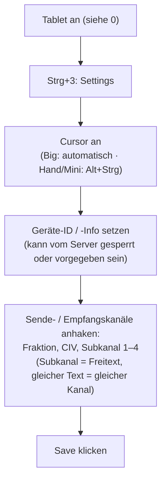

## 2. GPS-Karte

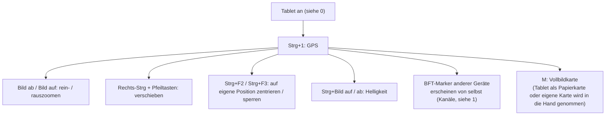

## 3. Chat-Nachricht schreiben

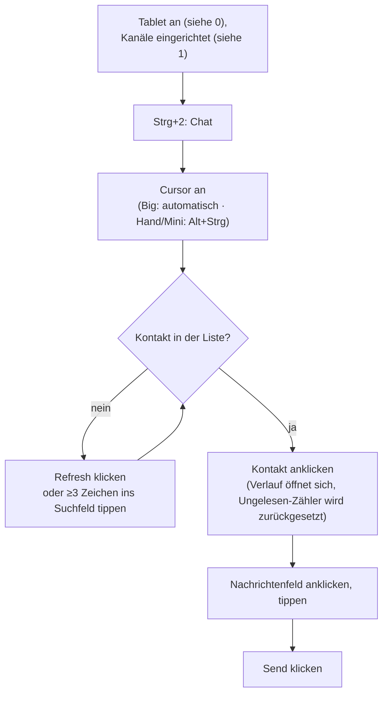

Ungelesene Nachrichten werden pro Kontakt in der Liste gezählt; Öffnen des Kontakts setzt den Zähler zurück.

## 4. Helmkamera ansehen

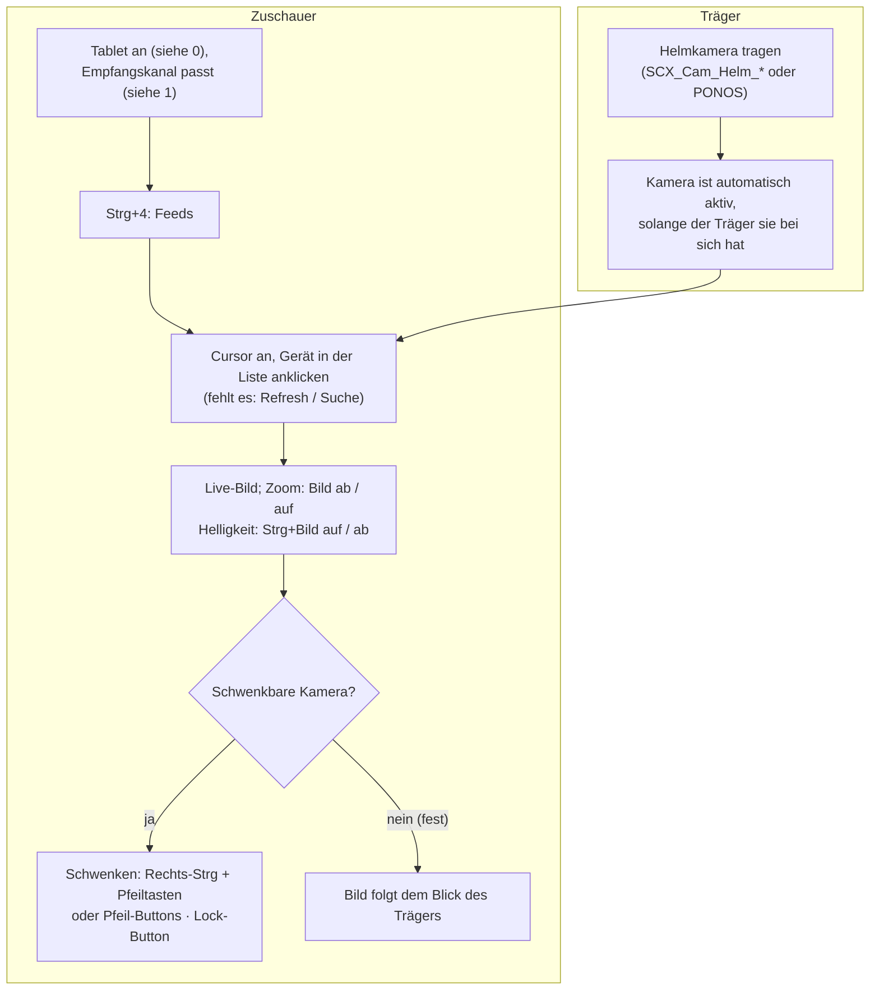

Es gibt **feste** und **schwenkbare** Helmkameras (pro Item eingestellt). Eine feste zeigt immer, wohin der Träger schaut; eine schwenkbare lässt sich zusätzlich vom Tablet aus drehen.

## 5. ARC-40-Kameragranate benutzen

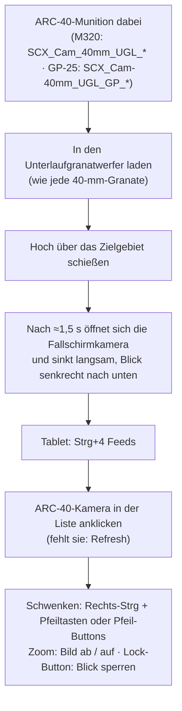

Jeder mit passendem Empfangskanal sieht die ARC-40 in seiner Feeds-Liste — du kannst so für den ganzen Trupp aufklären.
